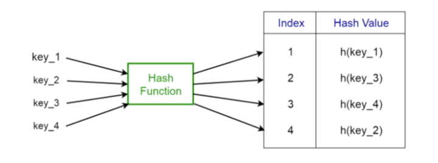
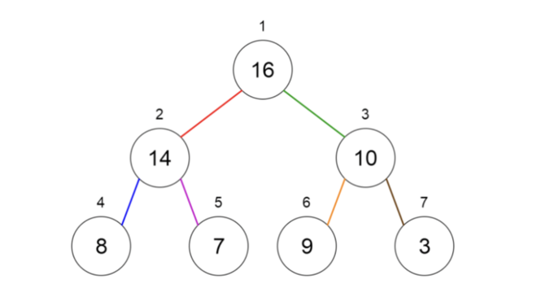

# Data Structure
자료구조 = 자료형의 모음집

ex) array는 Int(string..)이라는 자료형의 모음집


## 1. Array (Slice) (배열) [ , , , , , ]

- 동형 자료구조(array 안에는 같은 자료형만 들어갈 수 있음) <-> 이형자료구조 : 구조체{} (구조체 안에는 서로 다른 자료형이 들어갈 수 있음)
- reference type

yumin := [a, b, c]

yumin이라는 array의 주소는 첫 번째 index의 주소

yumin[0] = a

** 2차원 배열 [][] **
- 몇 번째 row?
- 몇 번째 coloumn?

## 2. Linked list (연결 list)

** 시간 복잡도 **

= 이 행위를 하는데 얼마나 걸리느냐

ex) O()
-> 괄호 안에 들어갈 수 있는 것 : 1(상수시간)(cpu 돌리는 데에 걸리는 시간 - 아주 빠른 시간) / log n / n / .....

n이란?

```go
for i, v := range.A{
}
```
for문 하나를 도는 시간 : n

A의 length가 커지면 커질수록 n도 커짐

A배열 안에 값을 넣는 것은 상수시간

-> A배열 안에 값을 넣으려면 index와 size를 알아야함!

** append : index를 모를 때 append를 사용할 수 있음 / 가상으로 capacity를 만들고(마지막 index 값을 찾음 = O(n)), 값을 넣음(=O(1))-> 시간이 엄청 느림
-> O(n) * O(1) = O(n) 시간이 걸림

T(x) = 2n제곱+n+3

O(n제곱)

-> BigO는 최악의 경우를 보는 것이기 때문에 최대의 항수를 통해 BigO를 결정함


각 node는 next node의 주소를 가지고 있음 == next

```go
type node structure {
	Next *node
	key int
}

type LinkedList struture {
	Head *node
}
```

대부분의 배열은 크기를 모른다 -> len으로 배열의 크기를 정해줘야함.

Linked list에 값을 insert하는 것은 tail 맨 뒤에 넣어야함.

linked list에 값을 insert하는 시간 : O(n) (=tail을 찾는 시간) * O(1) (tail 뒤에 새로운 값을 넣는 시간)

- example : 순서가 있는 경우 / 갤러리 사진 삭제 / alt tab

double linked list? 양방향으로 된 linked list를 사용하면 head와 tail을 구분짓지 않기 때문에 더 짧게 사용할 수 있음

## 3. Stack

last in first out (마지막에 들어온게 처음으로 나간다.)

- 중간에 있는 걸 꺼낼 수 없고 차례대로 쌓임

- push(넣기), pop(빼기) : O(1)
- size(크기), top(맨위)

* 예시
  * call stack
  * 함수의 재귀적 호출에도 사용됨 (ex. 피보나치)
  * 중위 표기법을 후위 표기법으로 변환할 때 (연산자를 pop하면서 출력)

** 표기법
- 중위 표기법(인간) : 1+2
- 후위 표기법(컴퓨터) : 12+

## 4. Queve(Q)
first in first out

- enqueve / dequeve : O(1)
- 순서대로 뽑기
- front만 뽑음
- 스레드 : 일하는 주체 / 비동기, 동기, 동시성

## 5. hash table = map = dictionary


- key를 통해서 index를 갖고, 그 index를 통해서 value를 얻는다.
- 순서
  - key들이 하나의 hash function을 지나감
  - hash function을 통해서 idx를 알게 됨 (return 값이 idx)
  - 해당 idx에 따른 값을 반환
- 값 검색, 값 출력 : 데이터 크기와 상관없이 빠름
- hash function에 따라 성능과 속도가 결정됨
- tree map, hash map 의 차이를 아는 것이 중요함 (나중에 공부할 것)
- 예시
  - 데이터베이스 찾을 때
  - 사용자 login

## 6. Graph


[[Directed Graph]]
- 각 원 : node / vertex
- a, b는 인접한 node
- self-loop : 자기 자신을 도는 것
- Graph{a, b, c, d}
- E = {(a, c), (a,b), ......
- 예시
  - 웹 사이트끼리의 링크 연결
  - 미로 모양
- 배열, Linked list 등등으로 graph를 구현할 수 있음

[[Undirected Graph]]
- 예시
  - GPS

## 7. Tree


- 그래프와 같음
- 계층적 구조를 가진 그래프
- parent와 child가 있음
- binary tree (이진 트리)
- 수열과도 같음
- 완전 이진 트리 : depth-1이 포화 이진 트리이고 depth가 왼쪽부터 꽉 차있는 경우
- 예시
  - 검색 시 log아래n 만큼 시간 걸림
  - 배열과 Linked list는 O(n)만큼 걸리는데, 트리는 depth만큼만 가면 됨
  - 검색할 때는 해쉬, 트리를 많이 씀
  - 검색 트리 : 완전 이진 트리

## 8. Heap(힙)


- 이진트리
- 최대 힙 : parent >= child
- 최소 힙 : parent <= child
- 루트를 뽑으면 내림차순으로 뽑힘 == 힙 정렬 알고리즘 == 노드 개수(n) * log아래n 만큼 시간이 걸리기 때문에 아주 짧음
- array에서 정렬하는 시간 : n * n
- 예시
  - 힙 정렬 알고리즘
  - 우선순위 큐 == 정렬을 갖는 큐