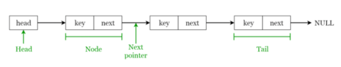

# Data Structure
자료구조 = 자료형의 모음집

ex) array는 Int(string..)이라는 자료형의 모음집


## Array (Slice) (배열) [ , , , , , ]

- 동형 자료구조(array 안에는 같은 자료형만 들어갈 수 있음) <-> 이형자료구조 : 구조체{} (구조체 안에는 서로 다른 자료형이 들어갈 수 있음)
- reference type

yumin := [a, b, c]

yumin이라는 array의 주소는 첫 번째 index의 주소

yumin[0] = a

** 2차원 배열 [][] **
- 몇 번째 row?
- 몇 번째 coloumn?

## Linked list (연결 list)

** 시간 복잡도 **

= 이 행위를 하는데 얼마나 걸리느냐

ex) O()
-> 괄호 안에 들어갈 수 있는 것 : 1(상수시간)(cpu 돌리는 데에 걸리는 시간 - 아주 빠른 시간) / log n / n / .....

n이란?

```go
for i, v := range.A{
}
```
for문 하나를 도는 시간 : n

A의 length가 커지면 커질수록 n도 커짐

A배열 안에 값을 넣는 것은 상수시간
-> a배열 안에 값을 넣으려면 index와 size를 알아야함!

** append : index를 모를 때 append를 사용할 수 있음 / 가상으로 capacity를 만들고(마지막 index 값을 찾음 = O(n)), 값을 넣음(=O(1))-> 시간이 엄청 느림
-> O(n) * O(1) = O(n) 시간이 걸림



각 node는 next node의 주소를 가지고 있음 == next

```go
type node structure {
	Next *node
	key int
}

type LinkedList struture {
	Head *node
}
```

대부분의 배열은 크기를 모른다 -> len으로 배열의 크기를 정해줘야함.

Linked list에 값을 inser하는 것은 tail 맨 뒤에 넣어야함.

linked list에 값을 insert하는 시간 : O(n) (=tail을 찾는 시간) * O(1) (tail 뒤에 새로운 값을 넣는 시간)

- example : 순서가 있는 경우 / 갤러리 사진 삭제 / alt tab

double linked list? 양방향으로된 linked list를 사용하면 head와 tail을 구분짓지 않기 때문에 더 짧게 사용할 수 있음